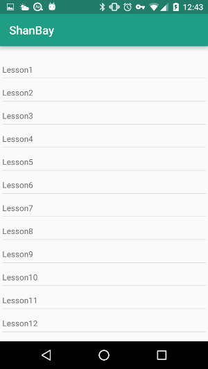
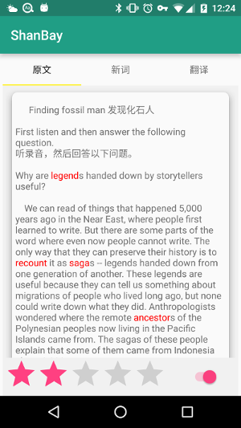
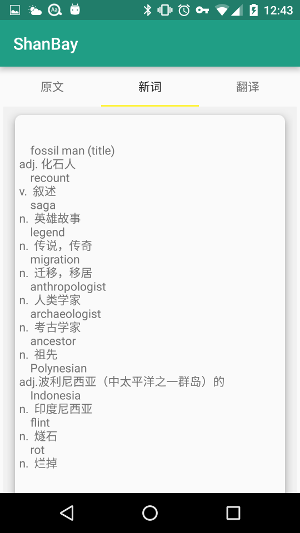
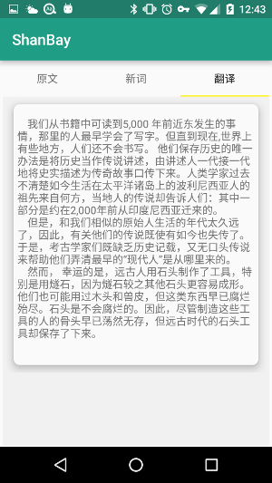

**本项目来自扇贝面试的作业**

**提供的素材**

1.  新概念4的文本，包括所有课文 [Link](materials/nce4.txt)
2.  单词列表 nce4_words.txt （每行一个单词，以及对应的等级） [Link](materialsnce4_words.txt)

**App要求**

这是一个简易的分级阅读程序， 基本功能是：

1. 打开后看到文章列表
2. 点击列表某项，打开文章
3. 文章界面有一个按钮，点击则在文章中高亮在单词列表中出现的单词
4. 文章界面有一个slide-bar，从0到6（对应单词表中每个单词信息的level)，可以拖动过滤高亮的单词。
当然你可以发挥自己的想象力来改进这些功能和交互

譬如 nce4_words的内容如下：

单词              级别  
compare         3  
backward        2  
technology      2  
alien                1

文本内容是
Compared with the alien, our technology is backward。  
如果slide-bar为2， 那么只高亮级别在2及以下的词，包括backward, technology,alien；  
如果slide-bar为3，那么高亮级别小于等于3的词。

完成情况截图：  

APK链接：
[APK download](apk/)
